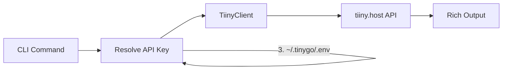

# TinyGo

[](https://github.com/msifoss/tinygo/actions/workflows/ci.yml)

**Deploy web pages to [tiiny.host](https://tiiny.host) from your terminal.**

TinyGo is a command-line tool that wraps the tiiny.host API, giving you fast, scriptable deployments for static HTML files and zip archives — no browser required.

---

## Features

- **One-command deploys** — push an HTML file or zip to a live URL in seconds
- **Auto-bundling** — deploys automatically scan HTML for linked local files, rewrite paths, and package everything as a zip (use `--no-bundle` to skip)
- **Secure by default** — every deployment is password-protected (auto-generated 15-char password) and blocked from search engine indexing (`noIndex`)
- **Deployment log** — every deploy, update, and delete is recorded; view history with `tinygo log`
- **Full lifecycle management** — deploy, update, and delete sites without leaving the terminal
- **Interactive prompts** — missing a domain name? TinyGo asks. Deleting a site? TinyGo confirms
- **Custom passwords** — override the auto-generated password with `--password`
- **Rich terminal output** — colored status messages, spinner during uploads, tabular site listings
- **Flexible auth** — provide your API key via config file, environment variable, or CLI flag
- **Auto domain normalization** — type `my-site` and TinyGo handles the `.tiiny.site` suffix for you

---

## Installation

**Requirements:** Python 3.9+

```bash
pip install tinygo
```

For AWS backend support:

```bash
pip install tinygo[aws]
```

### From source

```bash
git clone https://github.com/msifoss/tinygo.git
cd tinygo
python3 -m venv .venv
source .venv/bin/activate
pip install -e .
```

Verify the install:

```bash
tinygo --version
```

---

## Configuration

TinyGo needs a tiiny.host API key. You can get one from your [tiiny.host account dashboard](https://tiiny.host/dashboard).

### Option 1: Interactive setup (recommended)

```bash
tinygo config set-key
# Enter your tiiny.host API key: ****
# API key saved.
```

This saves the key to `~/.tinygo/.env`.

### Option 2: Environment variable

```bash
export TIINY_API_KEY="your-api-key-here"
```

### Option 3: Per-command flag

```bash
tinygo deploy index.html --api-key "your-api-key-here"
```

### Resolution order

When multiple sources are present, TinyGo resolves the API key with this priority:

| Priority | Source | Example |
|----------|--------|---------|
| 1 (highest) | `--api-key` flag | `tinygo deploy index.html --api-key abc` |
| 2 | `TIINY_API_KEY` env var | `export TIINY_API_KEY=abc` |
| 3 (lowest) | `.env` file | `~/.tinygo/.env` |

### View current config

```bash
tinygo config show
# api_key: ddc9...5e45
# secrets path: /Users/you/.tinygo/.env
# config path: /Users/you/.tinygo/config.yaml
```

The API key is always masked in output.

---

## Usage

### Deploy a new site

```bash
# With a domain name
tinygo deploy index.html --domain my-portfolio

# TinyGo prompts for a domain if you omit --domain
tinygo deploy index.html
# Choose a subdomain: my-portfolio

# Deploy a zip archive
tinygo deploy site.zip --domain my-app

# Deploy with a custom password (overrides auto-generated)
tinygo deploy index.html --domain secret-page --password s3cret

# Deploy a single file without bundling
tinygo deploy index.html --domain simple-page --no-bundle
```

Output:

```
Deployed! https://my-portfolio.tiiny.site
Password: NF$I47kudS%P4#U
```

Every deployment automatically generates a 15-character password and enables `noIndex` to block search engines. The password is displayed in the console but never written to the deployment log.

### Auto-bundling

By default, when your HTML references local files (stylesheets, scripts, images, other HTML pages — even from different directories), TinyGo scans for them, copies everything into a zip with rewritten paths, and deploys it.

What happens under the hood:
1. Parses `index.html` for `href`, `src`, and CSS `url()` references
2. Recursively scans any linked HTML files for their own dependencies
3. Copies everything into a temp staging directory
4. Rewrites absolute paths (e.g. `/Users/you/other-repo/report.html`) to relative paths
5. Zips and deploys, then cleans up temp files

Relative paths preserve their directory structure. Absolute paths are flattened into the staging root with automatic collision avoidance. Remote URLs (`http://`, `https://`), data URIs, and anchors are left untouched. Missing files are silently skipped.

Use `--no-bundle` to skip bundling and deploy a single file as-is.

### Update an existing site

```bash
tinygo update index.html --domain my-portfolio
```

Output:

```
Updated! https://my-portfolio.tiiny.site
Password: h#Mnd9SInkaR!M%
```

### Delete a site

```bash
# With confirmation prompt
tinygo delete --domain my-portfolio
# Delete site 'my-portfolio'? [y/N]: y
# Deleted my-portfolio

# Skip confirmation
tinygo delete --domain my-portfolio --yes
```

### List all sites

```bash
tinygo list
```

Output:

```
                Your Sites
┏━━━━━━━━━━━━━━━━━━━━━━━━━━━━┳━━━━━━━━━━━┳━━━━━━━━━━━━━━━━━━━━━━━━━━┓
┃ Domain                     ┃ Type      ┃ Created                  ┃
┡━━━━━━━━━━━━━━━━━━━━━━━━━━━━╇━━━━━━━━━━━╇━━━━━━━━━━━━━━━━━━━━━━━━━━┩
│ my-portfolio.tiiny.site    │ text/html │ 2026-03-01T05:46:41.241Z │
└────────────────────────────┴───────────┴──────────────────────────┘

Quota: 1/5 sites used
```

### View account profile

```bash
tinygo profile
```

Output:

```
email: you@example.com
sites: 1
max sites: 5
max file size: 75 MB
domains: tiiny.site
```

### View deployment history

Every deploy, update, and delete (success or failure) is automatically logged to `~/.tinygo/deployments.log`.

```bash
# Show full history
tinygo log

# Show last 5 entries
tinygo log -n 5

# Clear the log
tinygo log --clear
```

Output:

```
                         Deployment History
┏━━━━━━━━━━━━━━━━━━━━━┳━━━━━━━━┳━━━━━━━━━┳━━━━━━━━━━━━━━━━┳━━━━━━━━━━━━┳━━━━━━━┳━━━━━━━━━━━━━━━━━━━━━━━━━━━━━━━━━━┓
┃ Timestamp           ┃ Action ┃ Status  ┃ Domain         ┃ File       ┃ Size  ┃ Detail                           ┃
┡━━━━━━━━━━━━━━━━━━━━━╇━━━━━━━━╇━━━━━━━━━╇━━━━━━━━━━━━━━━━╇━━━━━━━━━━━━╇━━━━━━━╇━━━━━━━━━━━━━━━━━━━━━━━━━━━━━━━━━━┩
│ 2026-03-01 14:23:05 │ DEPLOY │ SUCCESS │ my-site        │ index.html │ 12.4KB│ https://my-site.tiiny.site       │
│ 2026-03-01 14:30:00 │ DELETE │ SUCCESS │ my-site        │            │       │                                  │
└─────────────────────┴────────┴─────────┴────────────────┴────────────┴───────┴──────────────────────────────────┘
```

---

## Command Reference

| Command | Description | Key Options |
|---------|-------------|-------------|
| `tinygo deploy <file>` | Deploy a new site | `--domain`, `--password`, `--no-bundle`, `--api-key` |
| `tinygo update <file>` | Update an existing site | `--domain` (required), `--password`, `--no-bundle`, `--api-key` |
| `tinygo delete` | Delete a site | `--domain` (required), `--yes`, `--api-key` |
| `tinygo list` | List all sites with quota | `--api-key` |
| `tinygo profile` | Show account info | `--api-key` |
| `tinygo log` | Show deployment history | `-n` (tail), `--clear` |
| `tinygo config set-key` | Save API key interactively | — |
| `tinygo config show` | Display current config | — |

All commands support `--help` for detailed usage:

```bash
tinygo deploy --help
```

---

## Architecture

```
tinygo/
├── pyproject.toml       # Package metadata, dependencies, entry point
├── .gitignore
└── tinygo/
    ├── __init__.py      # Version string
    ├── cli.py           # Click command definitions and Rich output
    ├── api.py           # TiinyClient — HTTP wrapper around tiiny.host API
    ├── config.py        # Config file I/O and API key resolution
    ├── bundle.py        # HTML scanning, file staging, path rewriting, zip creation
    └── log.py           # Deployment event logging (write, read, clear)
```

### How it works



**`cli.py`** defines the Click command group and handles user interaction (prompts, confirmations, `--help`). Each command resolves an API key, builds a `TiinyClient`, calls the relevant method, and formats the response with Rich.

**`api.py`** contains `TiinyClient`, a thin wrapper over the four tiiny.host API endpoints. It manages the `requests.Session`, multipart form-data encoding, domain normalization (appending `.tiiny.site`), and error handling via `TiinyError`.

**`config.py`** reads and writes `~/.tinygo/.env` (secrets) and `~/.tinygo/config.yaml` (settings), implements the three-tier API key resolution (flag > env var > .env file), and auto-migrates legacy `config.json` on first read.

**`bundle.py`** scans HTML files for local file references (`href`, `src`, CSS `url()`), recursively follows linked HTML, copies everything into a temp staging directory with rewritten paths, and produces a deployable zip.

**`log.py`** appends tab-separated deployment events to `~/.tinygo/deployments.log` and provides read/clear functions for the `tinygo log` command.

### API Endpoints Used

| Method | Endpoint | Purpose |
|--------|----------|---------|
| `POST` | `/v1/upload` | Create a new site (multipart: files + domain + siteSettings) |
| `PUT` | `/v1/upload` | Update an existing site (multipart: files + domain + siteSettings) |
| `DELETE` | `/v1/delete` | Delete a site (multipart: domain) |
| `GET` | `/v1/profile` | Fetch account profile, site list, and quota |

All requests are authenticated with the `x-api-key` header against `https://ext.tiiny.host`.

---

## Troubleshooting

### "No API key configured"

You haven't set an API key yet. Run:

```bash
tinygo config set-key
```

Or export it as an environment variable:

```bash
export TIINY_API_KEY="your-key"
```

### "The provided domain is not valid"

Domain names must follow tiiny.host naming rules. TinyGo automatically appends `.tiiny.site`, so pass only the subdomain portion:

```bash
# Correct
tinygo deploy index.html --domain my-site

# Also works — TinyGo won't double-append
tinygo deploy index.html --domain my-site.tiiny.site
```

### "Deploy failed" or "Update failed"

- Verify your API key is valid: `tinygo profile`
- Check that you haven't exceeded your site quota: `tinygo list`
- Ensure the file exists and is a valid HTML file or zip archive

### Command not found: tinygo

Make sure you've activated the virtual environment:

```bash
source .venv/bin/activate
```

---

## Cost

TinyGo is free and open source. tiiny.host account limits apply — check your plan's quota with `tinygo profile`.

---

## Contributing

1. Fork the repo
2. Create a feature branch (`git checkout -b feature/my-feature`)
3. Make your changes
4. Test against the live API with a tiiny.host account
5. Submit a pull request

---

## License

MIT
